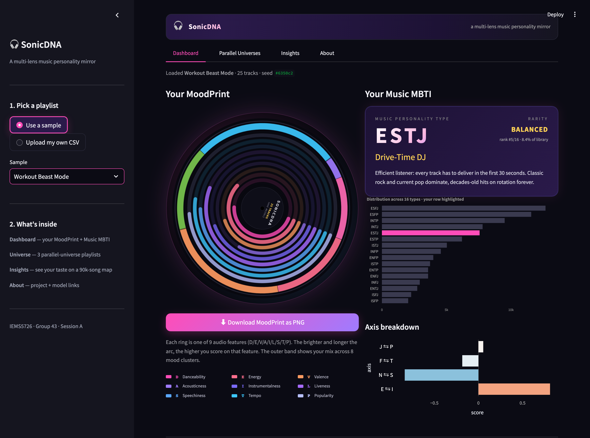

# SonicDNA — A Multi-Lens Music Personality Mirror

> **IEMS5726 Data Science in Practice · 2025–26 Term 2 / Session A · Group 43**
> Members: Xupeng ZHANG (1155238738) · Zetao HUANG (1155251352)

[](https://www.python.org/)
[](https://streamlit.io)
[](https://www.docker.com/)
[](#license)

SonicDNA 把一个 Spotify 歌单变成 *视觉 / 心理学 / 推荐* 三个维度的音乐画像。
单一 9 维音频特征向量驱动三个互补模块：

- **MoodPrint** — 把整张歌单压缩成一张「黑胶唱片指纹」，9 条同心音轨表达 9 个 audio feature 强弱，外圈 8 段彩色 wedge 表达 mood-cluster 占比。两张不同的歌单永远不会出同一张图。
- **Music MBTI** — 在 4 条复合轴 (E/I, N/S, F/T, J/P) 上把歌单约简成 4 字符人格码，对应 16 种音乐人格，每种附手写一句话描述。
- **Parallel-Universe Playlists** — 用 `u + α(a − u)` 把用户的口味中心「平移 70%」到 Neon Synthwave Drive / Lo-fi Study Den / Mosh Pit Riot 三个手作宇宙的中心，再在该宇宙的歌池里跑余弦推荐。回答「如果你在那个世界长大，你会听什么？」



---

## Project Highlights

| | 决策 | 实现 |
|---|---|---|
| 数据源 | 离线 Kaggle 89,740 首歌曲，避开 2024-11 Spotify Web API 弃用 | `pipeline/preprocess.py` + `kagglehub` |
| 表示 | 9 维 z-scored audio feature 向量 | `StandardScaler` × 9 维 |
| 聚类 | KMeans k=8 with rule-based 命名 | `pipeline/cluster.py` |
| MBTI | 4 轴 composite z-score 求和（非分类器，避免类别不平衡） | `pipeline/mbti.py` |
| 推荐 | 余弦相似度 + 多样性约束（每艺人 ≤1，每 meta-genre ≤3） | `pipeline/recommender.py` |
| 平行宇宙 | α=0.7 线性插值，保留 30% 用户原本方向 | `pipeline/parallel_universe.py` |
| MoodPrint | 9 条同心 ring + 外圈 wedge，matplotlib `Wedge` + 圆弧端点 | `pipeline/moodprint.py` |
| 部署 | 单 Dockerfile，构建时下数据 + 跑 pipeline | `application/Dockerfile` |

---

## Repository Layout

```
.
├── source_code/              # Data-science pipeline (评分 45%)
│   ├── data/
│   │   ├── raw/              # Kaggle CSV (gitignored)
│   │   └── processed/        # 清洗后的 parquet (gitignored)
│   ├── notebooks/            # EDA / cluster verification / report builder
│   ├── pipeline/             # preprocess / cluster / mbti / moodprint / recommender / parallel_universe
│   ├── models/               # *.pkl artifacts (gitignored — 见 §Pretrained Models)
│   │   └── figures/          # 图表（committed）
│   └── requirements.txt
├── application/              # Streamlit deployment (评分 15%)
│   ├── app.py                # 入口
│   ├── components/sidebar.py # UI 组件
│   ├── tabs/                 # 4 个 tab 各自的视图逻辑
│   ├── styles.py             # 全局 CSS
│   ├── caching.py            # @st.cache_data 包装
│   ├── samples/              # 内置 sample playlist CSV
│   ├── Dockerfile
│   └── requirements.txt
├── report_tex/               # LaTeX project report
│   ├── Group43_report.tex
│   ├── Group43_report.pdf    # 已编译版
│   ├── figures/              # 8 张分析图副本
│   └── screenshots/          # 4 张界面截图副本
├── screenshots/              # UI 截图原图（Playwright 自动捕获）
├── build_screenshots.py      # 自动 UI 截图脚本
├── build_submission.py       # 一键打 Group43_source.zip
├── .gitignore
└── README.md
```

---

## Quick Start

### 1. Prepare Python environment

```bash
python3 -m venv .venv
source .venv/bin/activate
pip install -r source_code/requirements.txt
pip install -r application/requirements.txt
```

### 2. Download dataset (~110 MB)

```bash
python -c "import kagglehub; print(kagglehub.dataset_download('maharshipandya/-spotify-tracks-dataset'))"
# 把打印出的目录里的 dataset.csv 拷贝到 source_code/data/raw/
```

或手动下载 [Kaggle Spotify Tracks Dataset](https://www.kaggle.com/datasets/maharshipandya/-spotify-tracks-dataset) 后放到 `source_code/data/raw/`。

### 3. Run the offline pipeline

```bash
cd source_code
python -m pipeline.preprocess        # 89,740 unique tracks → parquet
python -m pipeline.cluster           # KMeans k=8 + 命名 + PCA
python -m pipeline.parallel_universe # 三个宇宙的 centroid + pool
```

### 4. Launch the app

```bash
cd application
streamlit run app.py
# 浏览器打开 http://localhost:8501
```

### 5. Run with Docker

```bash
cd application
docker compose up --build      # 第一次构建 ~5 分钟（含拉数据 + 跑 pipeline）
# 浏览器打开 http://localhost:8501
```

---

## Live Demo

> 公开演示链接见 §Submission Links（部署后填入）。

---

## Pretrained Models

`source_code/models/*.pkl` 不进 git（避免 binary blob），但完整训练好的工件可以从下面链接下载：

> Google Drive 链接见 §Submission Links（部署后填入）。

下载后解压到 `source_code/models/`，目录结构应为：

```
source_code/models/
├── scaler.pkl              # StandardScaler over 9 audio features
├── kmeans_mood.pkl         # KMeans(k=8) over z-scored space
├── pca.pkl                 # 2-D PCA used by the Insights scatter map
├── mood_cluster_names.json # 8 个 cluster 的可解释命名
└── figures/                # 7 张分析图（已在 git 里）
```

如果你不下载这些 `.pkl`，第 3 步 `python -m pipeline.preprocess` 会自动重新生成它们（约 2 分钟）。

---

## Project Report

完整报告（含 problem / data / modeling / visualization / architecture / UI / challenges / refs / AI declaration）：

- LaTeX 源：[`report_tex/Group43_report.tex`](report_tex/Group43_report.tex)
- 编译版 PDF：[`report_tex/Group43_report.pdf`](report_tex/Group43_report.pdf)

本地编译：

```bash
cd report_tex
pdflatex Group43_report.tex && pdflatex Group43_report.tex   # 双 pass for ToC
```

或直接把整个 `report_tex/` 文件夹上传到 [Overleaf](https://www.overleaf.com) 做云端编译。

---

## Submission Links

| 项目 | 链接 |
|---|---|
| Source repository | （即本仓库） |
| Live demo | _coming soon_ |
| Pretrained models (Google Drive) | _coming soon_ |
| Demo video (≤10 min) | _coming soon_ |

---

## License

MIT License — 仅供 IEMS5726 课程评审与学习使用，**不**包含 Kaggle Spotify Tracks Dataset 内容；数据集的版权归原作者 Maharshi Pandya 所有，请按 Kaggle 数据集条款获取。
